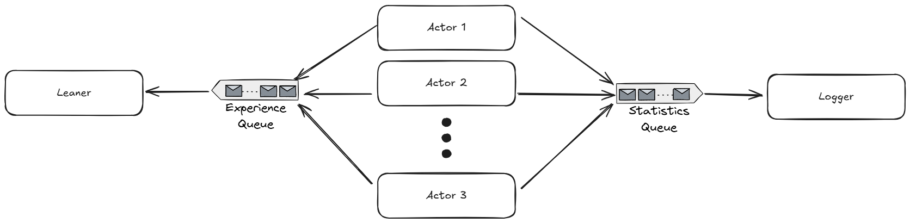
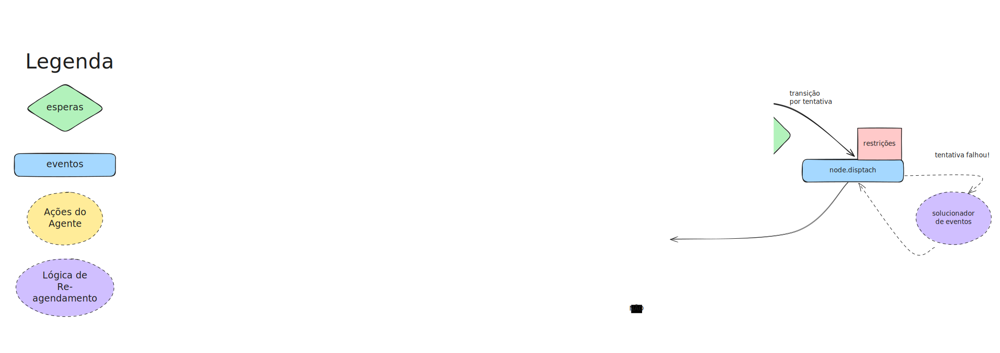
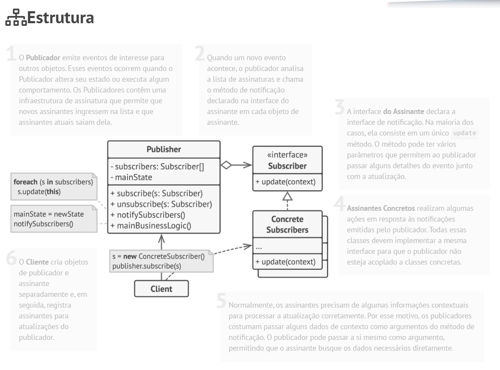

# Documentação do Treinamento DQNRouter

Este documento descreve a arquitetura e o funcionamento do **sistema de treinamento do DQNRouter**, implementado no arquivo `train_DQNRouter.py`.

---

## 📌 Visão Geral

O código implementa uma arquitetura **Actor-Learner distribuída**, inspirada em algoritmos como **Ape-X DQN**.  
A ideia central é separar o processo de **coleta de experiências** (atores) do processo de **aprendizado da rede neural** (learner).  

### Componentes principais:
- **Actor (Atores):** executam episódios da simulação, interagem com o ambiente e produzem experiências.
- **Learner (Aprendiz):** atualiza a rede neural (policy e target networks) com base nas experiências recebidas.
- **Logger:** registra métricas de desempenho de cada episódio.
- **Experience Queue:** conecta atores ao learner.
- **Statistics Queue:** conecta atores ao logger.



---

## ⚙️ Fluxo do Treinamento

1. **Carregamento do modelo base**
   - O estado inicial do sistema ferroviário é carregado de um arquivo `.dill`.
   - É construído o espaço de **estados** e o espaço de **ações**.

2. **Execução de Episódios (Actor)**
   - Cada ator roda uma simulação de 30 dias:
     - Observa o estado.
     - Escolhe uma ação (via DQN ou aleatória, conforme política).
     - Recebe a recompensa e transição.
   - As transições são enviadas para o **Learner** via `experience_queue`.
   - Estatísticas (volume operado, demanda atendida) são enviadas para `output_queue`.

3. **Atualização da Rede (Learner)**
   - O **Learner** roda em processo separado.
   - Ele consome experiências da `experience_queue` e aplica:
     ```python
     learner.update(experience)
     ```
   - Periodicamente salva os pesos das redes (`policy_net` e `target_net`).

4. **Registro dos Resultados (Logger)**
   - O **Logger** consome dados da `output_queue`.
   - Gera arquivos `.log` com métricas por episódio.

5. **Loop Principal**
   - Executa `TRAINING_STEPS`.
   - Em cada passo:
     - Lança processos de **atores**.
     - Espera terminarem.
     - Solicita ao **Learner** salvar os modelos atualizados.
   - Ao final, todos os processos são encerrados.

---

## Detalhes de Implementação

### Simulação e Criação das Transições

O fluxo básico de simulação de um trem é descrido na figura abaixo. Os eventos principais são:

* Chegada do trem a um determinado nó da ferrovia (terminais de carregamento/descarregamento);
* Início do processamento (carregamento ou descarregamento);
* Fim do processamento;
* Liberação do trem;
* Envio para a próxima estação. Caso não existe uma próxima estação, o roteador (agente tomador de decisão) decide para qual fluxo enviar o trem.



O disparo dos eventos é gerenciado pelo simulador, e é responsável por alterar o estado do sistema. Por esse motivo, os **roteadores baseados em memória** (que implementam Q-learning ou DQN, por exemplo), precisam que o simulador utilize um evento que execute uma rotina de captura do estado anterior (s) e posterior (s') ao evento (a), além de salvar essa transição (s, a, s') em uma memória. Para implementar esse comportamento, utilizamos o padrão de projeto Decorator, através da classe `DecoratedEventFactory`. Sua implementação base é apresentada a seguir:

```python
class DecoratedEventFactory(EventFactory):
    def __init__(self, pos_method: Callable, pre_method: Callable):
        self.pos_method = pos_method
        self.pre_method = pre_method

    def wrapper(self, callback: Callable):
        def decorated(*args, **kwargs):
            self.pre_method(*args, **kwargs)
            try:
                callback(*args, **kwargs)
                self.pos_method(*args, **kwargs)
            except FinishedTravelException as e:
                kwargs['event_name'] = 'ROUTING'
                info(f"Taking a snapshot because event generate an exception: {e}")
                self.pos_method(*args, **kwargs)
                raise e
        return decorated
    
    def create(self, time_until_happen, callback, data):
      decorated_callback = self.wrapper(callback)
      return Event(
          time_until_happen,
          decorated_callback,
          data,
          event_name=f"Decorated {callback.__qualname__}"
      )
```

Nessa classe vemos o método `wrapper`, que recebe a callback do evento. Antes de executar a callback ela executa um `pre_method()`, e após executa um `pos_method()`. Ésses métodos são injetados em DecoratedEventFactory e encapsulam a lógica desejada. No caso, o comportamento que queremos encapsular está implementado na classe RailroadEvolutionMemory, onde o `save_previous_state` é o `pre_method` e `save_consequence` é o `pos_method`.


```python
class RailroadEvolutionMemory(AbstractSubject):
    def save_previous_state(self, *args, **kwargs):
        state = self.take_a_snapshot(is_initial=kwargs.get('is_initial', False))
        self.previous_state = state

    def save_consequence(self, *args, **kwargs):
      event_name = kwargs.get("event_name", "AUTOMATIC")
      next_state = self.take_a_snapshot(*args, **kwargs)
      self.save(
          s1=self.previous_state,
          s2=next_state,
          a=event_name,
          r=next_state.reward(),
      )

    def take_a_snapshot(self, *args, **kwargs) -> TFRState:
        is_initial = kwargs.get('is_initial', False)
        if not self.railroad:
            critical("Memory does not know the railroad and therefore does not perform any snapshots")
            return
        state = self.state_factory(railroad=self.railroad, is_initial=is_initial)
        return state
```

O método `take_a_snapshot` utiliza uma fábrica de estados (`self.state_factory`)para converter o modelo da ferrovia em um estado compreendido pelo algoritmo de aprendizagem. 


### Observação de Estados

A classe RailroadEvolutionMemory é reponsável por capturar os estados antes e deopis da execução dos eventos (ou seja, as experiências da simulação) e armazená-los em um vetor `.memory`. Já a classe `ExperienceProducer` é responsável por observar a atualização dessa memória e escrever as esperiências na fila `ExperienceQueue`. Esse comportamento foi implementasdo seguindo o padrão de projeto Observer, também conhecido como PubSub. A figura abaixo apresenta a estrutura base desse padrão, conforme documentado no [Refactoring Guru](https://refactoring.guru/design-patterns/observer). Para entender mais sobre a implementação desse padrão, acesse [Observadores e Sujeitos](<../Conceitos importantes/observers_and_subjects.md>).





### Aprendizado

Sempre que uma nova experiência é adicionada na `ExperienceQueue`, o processo responsável pela aprendizagem do roteador executa o método `learner.update()`, que implementa o algoritmo de aprendizado do DQN (Deep Q-learning Network) utilizando a biblioteca **TensorFlow**. Esse método funciona da seguinte forma:

```
1. Seleção de 15 experiências (s, a, s', r) aleatórias.
2. Converter estados, ações e recopensas em tensores.
3. Para cada "próximo estado", identificar as melhores "próximas ações" de acordo com a política atual.
4. Calcula o valor `Q` do próximo estado tomando a melhor "próxima ação" de acordo com a rede alvo.
5. Calcula o valor de `Q_bellman` para a recompensa atual e o valor de `Q` do próximo estado, conforme a equação de bellman:
  5.1 Equação de bellman: Q* = R + GAMMA * Q'
  5.2 Caso o próximo estado seja um estado terminal (ou seja, termina a simulação), Q* = R
6. Calcula o valor de `Q_rede` com base na rede atual
7. Compara o `Q_rede` obtido pela rede e o `Q_bellman` obtido pela equação de bellman e encontra a função de perda (loss function).
8. Ajusta os pesos da rede através de otimização com gradiente decendente e a loss function

```

---


## 📂 Estrutura de Processos

* Main Process: Cria e coordena subprocessos.

* Actor Processes: Rodam simulações independentes.

* Learner Process: Consome experiências e treina a rede.

* Logger Process: Armazena logs dos episódios.

## 🔑 Benefícios da Arquitetura

* Separação clara de responsabilidades:

    * Atores = coleta de dados.
    * Learner = atualização de rede.

* Escalabilidade:

    * Fácil aumentar o número de atores (paralelismo).

* Persistência:

    * Modelos são salvos periodicamente.
    * Experimentos são registrados em logs.

## 📊 Resumo

Essa implementação do DQNRouter é um sistema distribuído de aprendizado por reforço com arquitetura Actor-Learner.
Os episódios são gerados em paralelo, experiências são enviadas para o Learner, e os resultados são logados para análise futura.