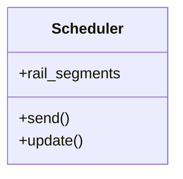

# Agendador

**Classe:** Scheduler

**Responsabilidade:** Agendar a chegada do trem ao próximo nó
quando a atividade do trem for definida como moving

**Colaboradores:**

* RailSegment: informa o próximo nó e o tempo para chegar até ele

## O que é agendar uma chegada?
É criar um evento node.receive para acontecer após determinado tempo de trânsito

## Componentes do scheduler
* Próximo nó
* Tempo de trânsito até o próximo nó

