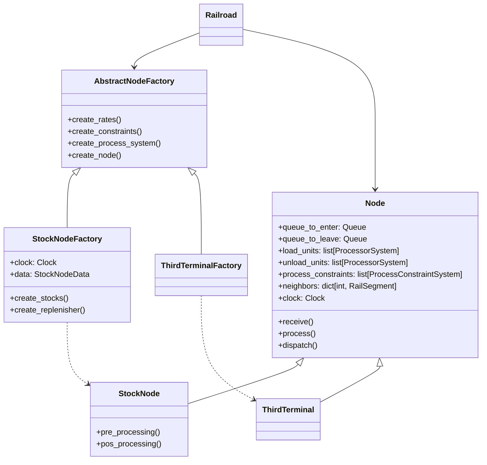

# Nós ferroviários - Node

**Classe**: `Node` e suas classes filhas.

**Responsabilidade:** Processar trens durante o ciclo de cada viagem, aplicando as restrições necessárias

**Colaboradores**:

* **Queue**: Responsável por armazenar os trens enquanto aguardar a liberação para processar ou para sair do nó;
* **ProcessorSystem**: Responsável por processar os trens (carregar, descarregar ou qualquer outro tipo de processo que 
possa vir a existir)
* **ProcessConstraintSystem**: Habilitam a liberação para iniciar o processamento o despacho do trem;
* **RailSegment**: Realiza o envio do trem para o próximo nó.

## Classes especializadas - Herança

Alguns nós possuem comportamentos e restrições específicas para se processar os trens. As classes especialistas que
herdam de `Node` são:

* **StockNode**: Nós que dependem da existência e controle de um estoque para realizar o processamento. Essa classe 
possui os seguintes colaboradores:
    * **StockInterface**:Define a interface de controle de estoque - especificada [nesse documento](../Recursos/Estoque/stock.md)

## Instanciação de um `Node`
Devido a complexidade para construir objetos do tipo `Node`, utilizamos o padrão de projeto **AbstractFactory** para 
construir as instâncias de nó. 

## Propriedades

* Um trem sempre deve ter o seu estado modificado após ser liberado de um nó.
* Um trem não pode ser adicionado à fila de saída de um nó enquanto as restrições de processamento permanecerem ativadas.
* Um trem não pode ser liberado da fila de saída de um nó enquanto as restrições de liberação permanecerem ativadas.
