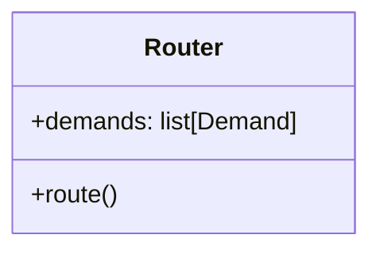

# Roteamento

## CRC

* **Classe:** Router
* **Responsabilidade:** Definir a próxima tarefa de um trem
* **Colaboradores:** - 

## Diagrama de Classe

```mermaid
classDiagram
    class Router{
        +demands: list[Demand]
        +route()
    }

```