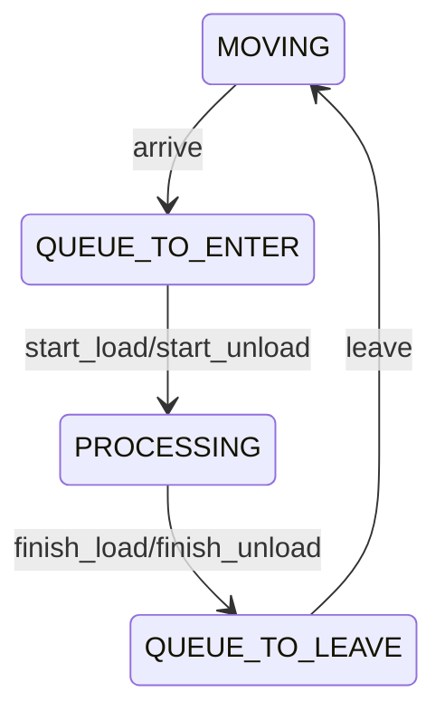

# Sistema de Atividades do trem 

O objetivo desse sistema é representar os estados de movimentação do trem. O trem está parado em fila? 
Processando? Em trânsito? Essas perguntas são respondidas por esse sistema.

A classe `ActivitySystem` define um conjunto simples de estados representados pela máquina de estados a seguir:

A classe possui a propriedade `path`, responsável por armazenar as próximas estações que o trem
deve percorrer para cumprir sua tarefa. Sempre que a transição `arrive` é acionada o objeto `path`
é atualizado.

