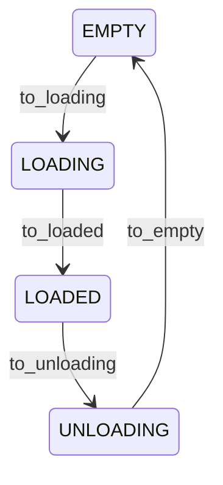

# Sistema de Carga do trem 

O objetivo desse sistema é representar o estado da carga do trem.
O trem está carregado? vazio? carregando? descarregando? Essas perguntas são respondidas por esses sistema

A classe `LoadSystem` implementa esse sistema, é é controlado pela máquina de estados abaixo:

A classe possui a propriedade `volume`. Responsável por informar o volume atual do trem.
Sempre que as transições `to_loaded` e `to_empty` são acionadas esse volume é atualizado.

