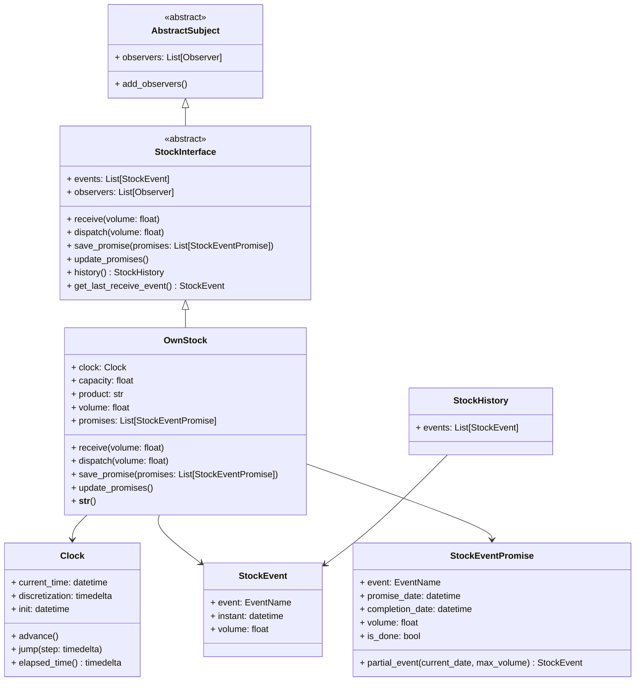

# Estoques

Este módulo implementa um sistema de gestão de estoque orientado a eventos, com suporte para promessas de movimentação futura e integração automática com o padrão Observer.

---

## 📦 Principais Componentes

### 1. `StockEvent`
- Representa um evento real no estoque.
- Campos:
  - `event`: Tipo do evento (`RECEIVE_VOLUME`, `DISPATCH_VOLUME`).
  - `instant`: Data e hora do evento.
  - `volume`: Quantidade movimentada.

### 2. `StockEventPromise`
- Representa uma promessa futura de movimentação de estoque.
- Campos:
  - `event`: Tipo de evento futuro.
  - `promise_date`: Data de início da promessa.
  - `completion_date`: Data esperada de conclusão.
  - `volume`: Quantidade a ser movimentada.
- Validação:
  - `completion_date` **deve ser posterior** ao `promise_date`.
- Método importante:
  - `partial_event(current_date, max_volume)`: Calcula movimentação parcial baseada no tempo decorrido.

### 3. `StockHistory`
- Guarda o histórico de eventos (`StockEvent`) associados a um estoque.

### 4. `StockInterface`
- Classe abstrata base para estoques.
- Define as operações principais:
  - `receive(volume)`: Receber produto.
  - `dispatch(volume)`: Despachar produto.
  - `update_promises()`: Atualizar promessas conforme o tempo.
  - `save_promise(promises)`: Registrar novas promessas.

### 5. `OwnStock`
- Implementação concreta do estoque.
- Adiciona:
  - Controle de capacidade máxima.
  - Volume atual.
  - Produto armazenado.
  - Lista de promessas pendentes.
- Integra-se com o sistema de notificações (`Observer Pattern`).

---

## 🔔 Integração com Observers

O `OwnStock` é observado por instâncias de `StockConstraint` ou outros observers.  
Sempre que um `receive()` ou `dispatch()` ocorre, os observadores são automaticamente notificados.

---

## 📈 Regras de Negócio

- Um estoque **não pode receber** além da sua capacidade.
- Um estoque **não pode despachar** mais do que seu volume atual.
- Promessas devem respeitar a relação `promise_date < completion_date`.
- Atualizações de promessas respeitam o tempo real do `Clock`.

---

## 🛠️ Exemplo de Uso

```python
from datetime import datetime, timedelta
from models.clock import Clock
from stock import OwnStock

# Criar um relógio
clock = Clock(start=datetime(2025, 4, 1), discretization=timedelta(hours=1))

# Criar estoque
stock = OwnStock(clock=clock, capacity=10000, product=\"aço\", initial_volume=500)

# Receber volume
stock.receive(1000)

# Despachar volume
stock.dispatch(200)

# Consultar histórico
history = stock.history()
for event in history.events:
    print(event)
```

## 🧪 Testes
O projeto inclui:

* `test_stock.py`: Testes determinísticos para todas as funcionalidades principais.

* `test_stock_hypothesis.py`: Testes baseados em Hypothesis para descoberta de falhas.

## 📋 Dependências
* `pytest` para execução dos testes.

* `hypothesis` para testes de propriedades.

Instalar as dependências:

```bash
pip install pytest hypothesis
```

## 📚 Observações Finais
Este sistema foi projetado para ser extensível e seguro:

* Garante integridade temporal dos eventos.

* Garante integridade de capacidade.

* Integração automática com observers evita inconsistências silenciosas.

## Diagrama de classe

