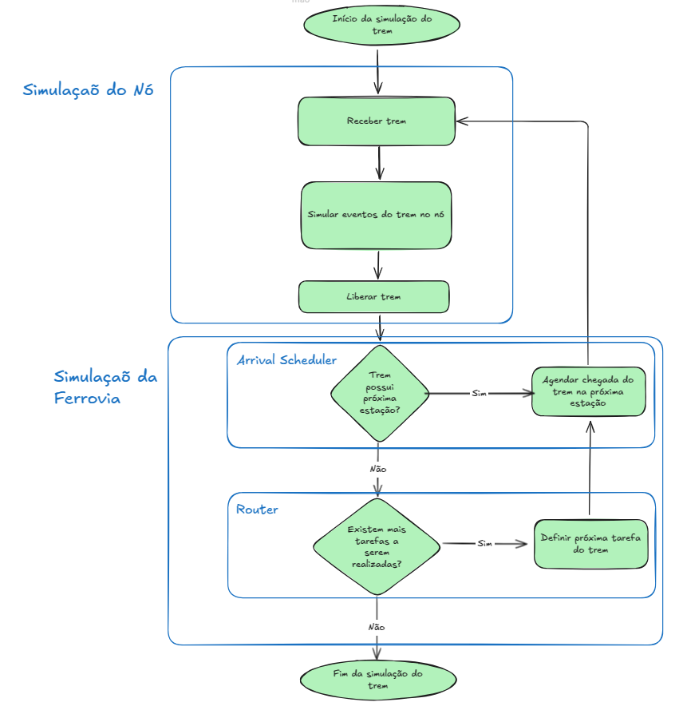

# Simulação

Uma simulação a eventos discretos (SED) é um tipo de modelagem computacional que simula a operação de um sistema como
uma sequência de eventos distintos no tempo. Ao contrário das simulações contínuas, onde o estado do sistema muda 
continuamente ao longo do tempo, na SED, o estado do sistema só muda em instantes específicos, quando ocorrem eventos. 
Entre esses eventos, assume-se que o sistema permanece inalterado.


## Máquinas de Estado

Máquinas de estados são frequentemente utilizadas na modelagem de sistemas para simulação a eventos discretos. Elas são 
uma ferramenta poderosa para descrever o comportamento de entidades dentro do sistema ao longo do tempo e em resposta a 
diferentes eventos.


## Fluxo de Simulação do trem


[//]: # (### Atendimento de fluxo - TravelState)

[//]: # ()
[//]: # (```mermaid)

[//]: # (stateDiagram-v2)

[//]: # (    FINISHED --> RUNNING: new_flow)

[//]: # (    RUNNING --> INVOICED: finish_load)

[//]: # (    INVOICED --> FINISHED: finish_unload)

[//]: # (```)



## Responsabilidades

* **Railroad**: É o modelo completo. É responsável por conter todas as entidades menores e representar o estado global do sistema para o simulador
  * Implicação: caso o estado seja representado de forma diferente, uma classe irmã de railroad deve ser implementada

* **Router**: Responsável por injetar eventos de decisão - new_flow()
  * Implicação: Aqui temos o algoritmo de otimização. Se a estratégia de otimização mudar, uma classe irmã deve ser implementada

* **Calendar**: Responsável por armazenar, ordenar e dispara os eventos de cada entidade;

* **Node**: Responsável por implementar as restrições de consumo e liberação de trens;

* **RailSegment**: Responsável por representar a posição dos trens quando não estiverem parados em nós;

* **Queue**: Responsável por representar os trens em estado ocioso da ferrovia.

# Conceitos
_anotações de estudo do software ARENA_
* **Entidades**: elementos que fluem no modelo. Corresponde aos clientes em um sistema de filas;
* **Recursos**: elementos com capacidade limitada pelos quais as entidades concorrem. Correspondem ao servidor em um sistema de filas;
* **Módulos**: Usados para compor a lógica do modelo.