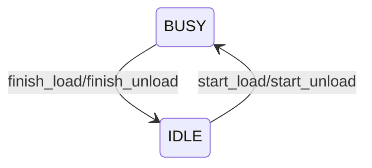
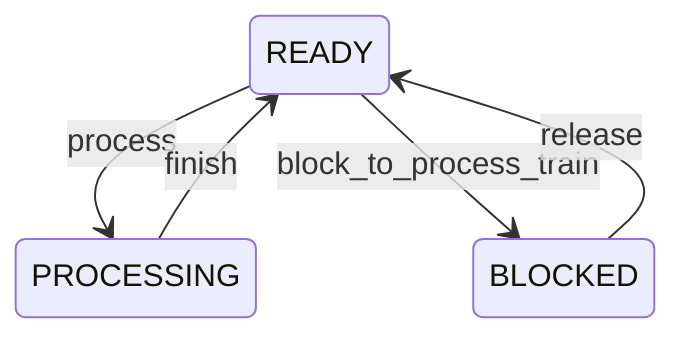

# Sistema de controle dos processos

O objetivo desse sistema é informar e controlar quando um processo pode ser iniciado ou não.
O sistema está ocioso? Podemos começar um processamento agora? Essas são perguntas responsidas por esse sistema.

Esse sistema é composto por duas classes: `ProcessorSystem`, responsável por informar se a unidade de 
processamento está ocupada ou ociosa, e a classe `ProcessConstraintSystem`, responsável por controlar quando um processo
pode ser iniciado ou não em determinado nó (classe `Node`). 

## ProcessorSystem

## ProcessConstraintSystem

