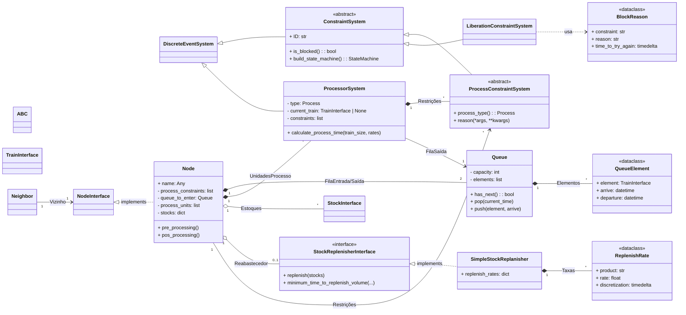

<!-- ```mermaid
classDiagram
    class Train {
        %% Atributos
        %% +int train_id 
        %% +float max_capacity
        %% +float volume
        %% +string next_station
        %% +string current_station
        +Task task
        +Activity activity
        +LoadState load_state
                
        +load()
        +unload()
        +arrive()
        +leave()
    }

    class Flow {
        +string product
        +string origin
        +string destination 
        +TravelState state
    }

    class Activity {
        <<enumeration>>
        +MOVING
        +LOADING
        +UNLOADING
        +WAITING_ON_QUEUE_TO_ENTER
        +WAITING_ON_QUEUE_TO_LEAVE
    }
    
    class LoadState {
        <<enumeration>>
        +FULL
        +EMPTY
    }
    
    %% class TravelState {
    %%     <<enumeration>>
    %%     +FINISHED
    %%     +RUNNING
    %%     +INVOICED
    %% }
    

    Train "1" --o "1" Activity : activity
    %% Processor "1" --o "1" Constraint 
    %% Constraint "1" --o "1" StateMachine
    %% Activity "1" --o "1" StateMachine
    %% LoadState "1" --o "1" StateMachine
    Train --o Scheduler 
    Scheduler --o "N" RailSegment 
    Scheduler --o Task 
    Train "1" --o "1" Task 
    Task "1" --o "1" Path 
    Task "1" --o "1" Demand 
    Task "1" --o "1" TimeTable 
    Demand "1" --o "1" Flow 
    Train "1" --o "1" LoadState 
%%    Train "1" --o "1" Railroad : fluxo_atual
    %% Flow "1" --o "1" TravelState : state


    class RailSegment {
        %% Atributos
        +string origin
        +string destination
        %% +list[Train] to_origin
        %% +list[Train] to_destination
        +timedelta time_to_origin
        +timedelta time_to_destination
        +get_snapshot()

    }
    Processor "1" o-- "1" Train : current_train
    Queue "1" o-- "1" Train 
    %% RailSegment "1" o-- "1" Train : to_origin/to_destination


    class Node {
        %% Atributos
        +string name
        +Queue to_enter
        +Queue to_leave
        +list[Processor] processors
        %% +list[RailSegment] RailSegmentes
        +receive()
        +process()
        +dispatch()
    }
    
        
    class Queue {
        +list[Train] queue
        
        +receive()
        +remove()
        +get_snapshot()
    }
    
    class Processor {
        %% +ProcessorState state
        +Train current_train
        +list[Constraint] constraints
        +put_int()         
        +free_up()         
        %% +get_snapshot()
    }
    %% class LoadProcessor{
    %%     +finish_load()
    %% }
    %% class UnloadProcessor{
    %%     +finish_unload()
    %% }
    %% Processor <|-- LoadProcessor : processors
    %% Processor <|-- UnloadProcessor : processors

    
    %% class ProcessorState {
    %%     <<enumeration>>
    %%     +BUSY
    %%     +IDLE
    %% }
    %% Node "1" o-- "N" RailSegment : processors     
    Node "1" o-- "N" Processor : processors
    %% Processor "1" o-- "1" ProcessorState : state

    Node "1" o-- "2" Queue : to_enter/to_leave
    
    class RailroadMesh{
        +Nodes nodes
        +RailSegments RailSegments
        +get_path()
    }

    class Scheduler{
        +list[RailSegments] rail_segments
        +Task task
        +send()
    }
    class Path{
        +current_location()
        +walk()
    }

    class TimeTable{
        +TimeRegister registers
        +update()
        +queue_time()
    }
    TimeTable "1" --o "N" TimeRegister 
    
    class TimeRegister{
        +datetime arrive
        +datetime start_process
        +datetime finish_process
        +datetime departure
    }

    class Railroad{
        +RailroadMesh mesh
        +list[Nodes] nodes
        +list[RailSegment] RailSegmentes
%%        +list[Train] finished_trains
        
%%        +simulate()
        +start_events()
        +solve_exceptions()
    }
    Railroad "1" --o "1" RailroadMesh 
    Railroad "1" --o "N" Train 

    RailroadMesh "1" --o "N" RailSegment 
    RailroadMesh "1" --o "N" Node 

    class Simulator{
        +Router router
        +Railroad railroad
        +Calendar calendar
        +Clock clock
        +simulate()
    }

    class Demand{
        +Flow flow
        +float volume
        +float operated

        +update()
    }
    class Task{
        +Demand demand
        +Path path
        +TimeTable time_table
        +update()
    }
    class Router{
        +list[demands] demands
        +route()
        +choose_task()
    }
    class Calendar{
        +list[Events] events
        +update()
        +push()
        +pop()
    }
    class Clock{
        +datetime current_time
        +update()
        +jump()
        +ellapsed_time()
    }
    
    Simulator "1" o-- "1" Router : router
    Simulator "1" o-- "1" Railroad : railroad
    Simulator "1" o-- "1" Calendar : calendar
    Simulator "1" o-- "1" Clock : clock
``` -->




asd