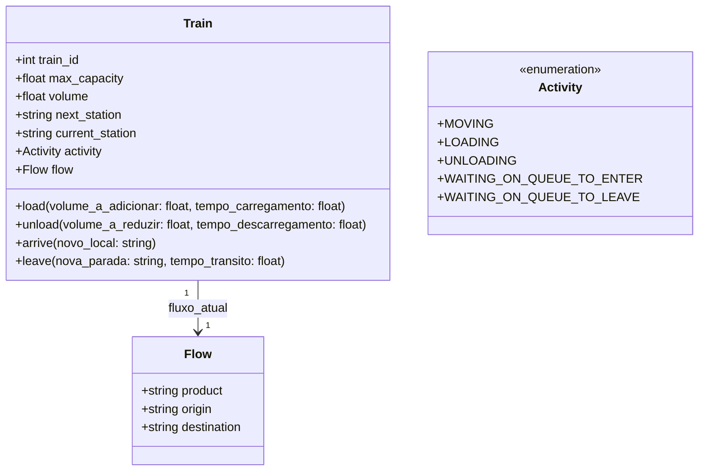

```mermaid

classDiagram
    class Train {
        %% Atributos
        +int train_id 
        +float max_capacity
        +float volume
        +string next_station
        +string current_station
        +Activity activity
        +Flow flow
        
        +load(volume_a_adicionar: float, tempo_carregamento: float)
        +unload(volume_a_reduzir: float, tempo_descarregamento: float)
        +arrive(novo_local: string)
        +leave(nova_parada: string, tempo_transito: float)
    }

    class Flow {
        +string product
        +string origin
        +string destination 
    }

    class Activity {
        <<enumeration>>
        +MOVING
        +LOADING
        +UNLOADING
        +WAITING_ON_QUEUE_TO_ENTER
        +WAITING_ON_QUEUE_TO_LEAVE
    }
    

    Train "1" --> "1" Flow : fluxo_atual
```