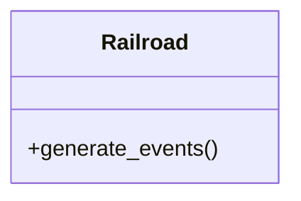

# Ferrovia

**Classe:** Railroad

**Responsabilidade:** gerar eventos de simulação para o calendário do simulador

**Colaboradores:**




```pseudo
função generate_events():
    para cada trem em transito:
        executa o método send() para agendar a chegada do trem no nó
    para cada nó:
        executa o método dispatch() para capturar os trens que estão em trânsito
    
```