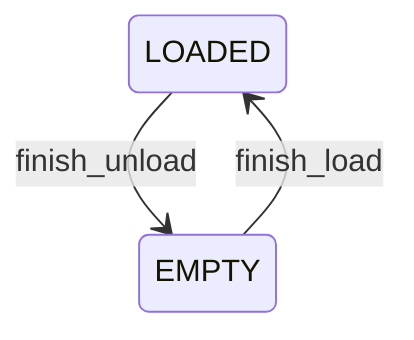
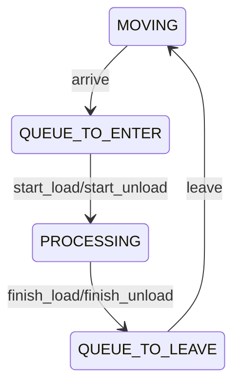
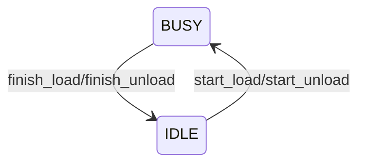
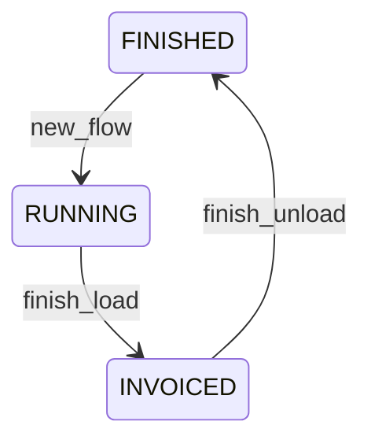
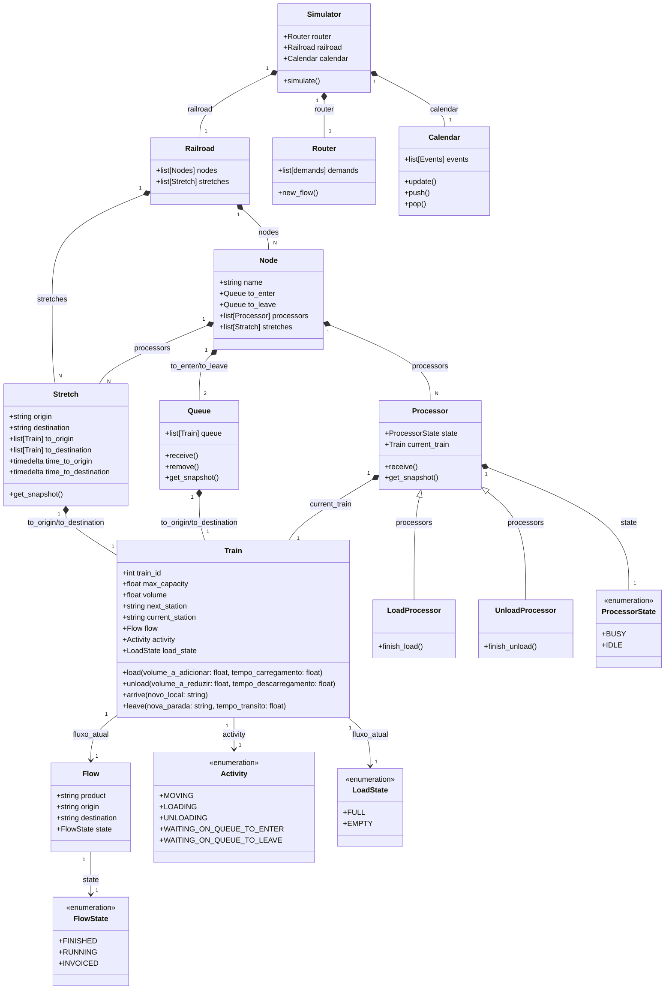

# Simulação

## Máquinas de Estado

### Carga do trem - LoadState

```mermaid
stateDiagram-v2
    %% [*] --> Cheio
    LOADED --> EMPTY: finish_unload
    EMPTY --> LOADED: finish_load
```

### Atividade do trem - Activity

```mermaid
stateDiagram-v2
    MOVING --> QUEUE_TO_ENTER: arrive
    QUEUE_TO_ENTER --> PROCESSING: start_load/start_unload
    PROCESSING --> QUEUE_TO_LEAVE: finish_load/finish_unload
    QUEUE_TO_LEAVE --> MOVING: leave
```

### Equipamento de processamento

```mermaid

stateDiagram-v2
    BUSY --> IDLE: finish_load/finish_unload
    IDLE --> BUSY: start_load/start_unload
```

### Atendimento de fluxo - FlowState

```mermaid
stateDiagram-v2
    FINISHED --> RUNNING: new_flow
    RUNNING --> INVOICED: finish_load
    INVOICED --> FINISHED: finish_unload
```

## Entidades

```mermaid

classDiagram
    class Train {
        %% Atributos
        +int train_id 
        +float max_capacity
        +float volume
        +string next_station
        +string current_station
        +Flow flow
        +Activity activity
        +LoadState load_state
                
        +load(volume_a_adicionar: float, tempo_carregamento: float)
        +unload(volume_a_reduzir: float, tempo_descarregamento: float)
        +arrive(novo_local: string)
        +leave(nova_parada: string, tempo_transito: float)
    }

    class Flow {
        +string product
        +string origin
        +string destination 
        +FlowState state
    }

    class Activity {
        <<enumeration>>
        +MOVING
        +LOADING
        +UNLOADING
        +WAITING_ON_QUEUE_TO_ENTER
        +WAITING_ON_QUEUE_TO_LEAVE
    }
    
    class LoadState {
        <<enumeration>>
        +FULL
        +EMPTY
    }
    
    class FlowState {
        <<enumeration>>
        +FINISHED
        +RUNNING
        +INVOICED
    }
    

    Train "1" --> "1" Activity : activity
    Train "1" --> "1" Flow : fluxo_atual
    Train "1" --> "1" LoadState : fluxo_atual
%%    Train "1" --* "1" Railroad : fluxo_atual
    Flow "1" --> "1" FlowState : state

%% # (```)

%% # ()
%% # (### Stretch)
%% # ()
%% # (**Responsabilidade**: informar a posição dos trens entre uma origem e um destino)

%%```mermaid

%%classDiagram
    class Stretch {
        %% Atributos
        +string origin
        +string destination
        +list[Train] to_origin
        +list[Train] to_destination
        +timedelta time_to_origin
        +timedelta time_to_destination
        +get_snapshot()

    }
    Processor "1" *-- "1" Train : current_train
    Queue "1" *-- "1" Train : to_origin/to_destination
    Stretch "1" *-- "1" Train : to_origin/to_destination


    class Node {
        %% Atributos
        +string name
        +Queue to_enter
        +Queue to_leave
        +list[Processor] processors
        +list[Stratch] stretches

    }
    
        
    class Queue {
        +list[Train] queue
        
        +receive()
        +remove()
        +get_snapshot()
    }
    
    class Processor {
        +ProcessorState state
        +Train current_train
        
        +receive()         
        +get_snapshot()
    }
    class LoadProcessor{
        +finish_load()
    }
    class UnloadProcessor{
        +finish_unload()
    }
    Processor <|-- LoadProcessor : processors
    Processor <|-- UnloadProcessor : processors

    
    class ProcessorState {
        <<enumeration>>
        +BUSY
        +IDLE
    }
    Node "1" *-- "N" Stretch : processors     
    Node "1" *-- "N" Processor : processors
    Processor "1" *-- "1" ProcessorState : state

    Node "1" *-- "2" Queue : to_enter/to_leave
    
    class Railroad{
        +list[Nodes] nodes
        +list[Stretch] stretches
%%        +list[Train] finished_trains
        
%%        +simulate()
    }
    Railroad "1" *-- "N" Stretch : stretches
    Railroad "1" *-- "N" Node : nodes

    class Simulator{
        +Router router
        +Railroad railroad
        +Calendar calendar
        
        +simulate()
    }

    class Router{
        +list[demands] demands
        +new_flow()
    }
    class Calendar{
        +list[Events] events
        +update()
        +push()
        +pop()
    }
    
    Simulator "1" *-- "1" Router : router
    Simulator "1" *-- "1" Railroad : railroad
    Simulator "1" *-- "1" Calendar : calendar

    


```