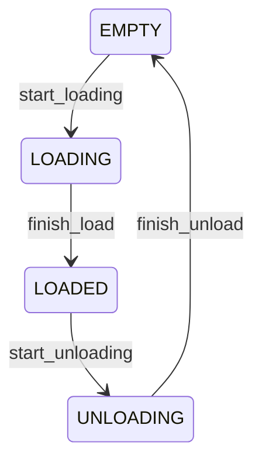
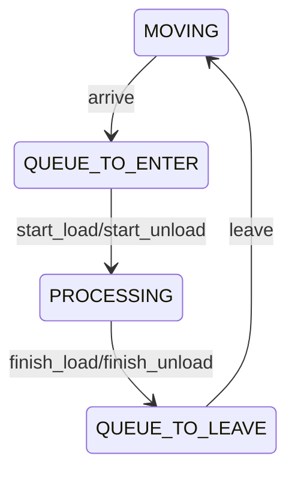
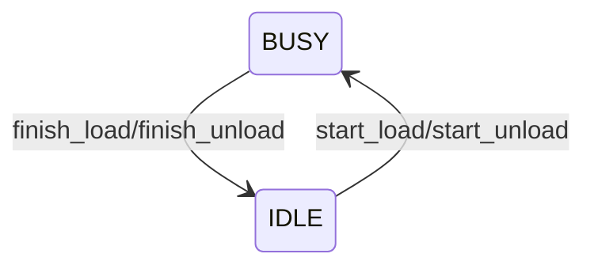
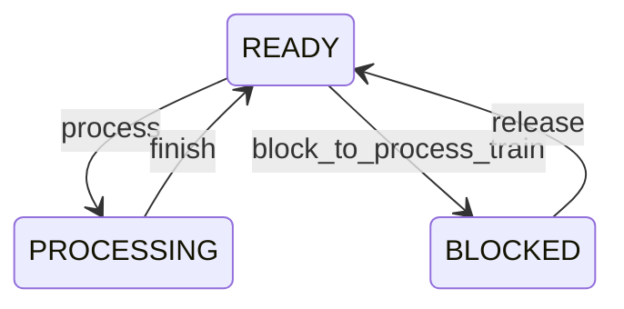
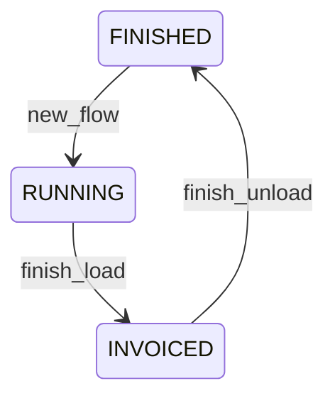
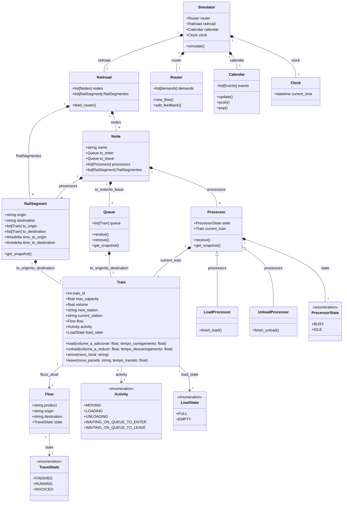

# Simulação

## Máquinas de Estado

### Carga do trem - LoadState

Transições:

* start_loading/start_unloading: só é disparada se a atividade do trem for Processing
* finish_loading/finish_unloading: só é disparada quando a ativdade for queue_to_leave

### Atividade do trem - Activity

### Equipamento de processamento

### Habilitação de processamento

### Atendimento de fluxo - TravelState

## Estados Compostos

- TRAIN N -> LOAD_STATE | ACTIVITY | TRAVEL_STATE
- NODE M -> PROCESSOR_STATE | QUEUE Q_ENTER | QUEUE Q_LEAVE
- RAIL_SEGMENT R - TO_ORIGIN | TO_DESTINATION

## Ações

-> NEW_TRAVEL 

## Entidades

## Responsabilidades

* **Railroad**: É o modelo completo. É responsável por conter todas as entidades menores e representar o estado global do sistema para o simulador
  * Implicação: caso o estado seja representado de forma diferente, uma classe irmã de railroad deve ser implementada

* **Router**: Responsável por injetar eventos de decisão - new_flow()
  * Implicação: Aqui temos o algoritmo de otimização. Se a estratégia de otimização mudar, uma classe irmã deve ser implementada

* **Calendar**: Responsável por armazenar, ordenar e dispara os eventos de cada entidade;

* **Node**: Responsável por implementar as restrições de consumo e liberação de trens;

* **RailSegment**: Responsável por representar a posição dos trens quando não estiverem parados em nós;

* **Queue**: Responsável por representar os trens em estado ocioso da ferrovia.